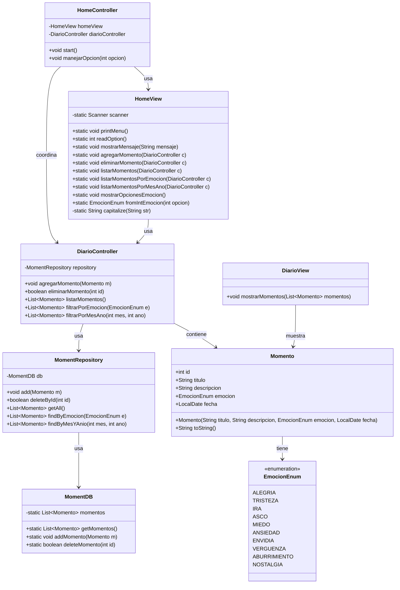
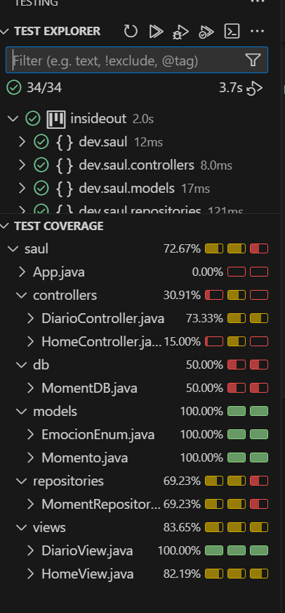

# Inside Out - Mi Diario de Emociones

## Descripción

Inside Out es una aplicación de consola en Java para registrar y gestionar momentos vividos, asociados a diferentes emociones. Permite agregar, listar, buscar y eliminar momentos, así como filtrarlos por emoción o por mes y año.

El proyecto sigue una arquitectura simple con capas de **Model**, **View**, **Controller** y **Repository**, simulando persistencia en memoria.

## Estructura del Proyecto

- **models**: Contiene las clases `Momento` y `EmocionEnum`.
- **views**: Contiene `HomeView` y `DiarioView` para la interacción con el usuario.
- **controllers**: Contiene `HomeController` y `DiarioController` para gestionar la lógica de negocio y el flujo de la aplicación.
- **repositories**: Contiene `MomentRepository` y `MomentDB` para la gestión de almacenamiento de los momentos.

## Funcionalidades

1. **Agregar momento**: Registrar un momento con título, descripción, fecha y emoción.
2. **Listar momentos**: Mostrar todos los momentos guardados.
3. **Buscar momento por ID**: Encontrar un momento específico.
4. **Eliminar momento**: Eliminar un momento por su ID.
5. **Filtrar por emoción**: Mostrar momentos según su emoción.
6. **Filtrar por mes y año**: Mostrar momentos de un mes y año específicos.

## Diagrama de Clases


## Test Coverage


## Cómo Ejecutar

1. Clonar el repositorio.
2. Compilar las clases de Java.
3. Ejecutar `HomeController` para iniciar la aplicación.

```bash
javac -d bin src/main/java/dev/saul/**/*.java
java -cp bin dev.saul.controllers.HomeController
```

## Notas

- La persistencia es simulada en memoria usando `MomentDB`. Al cerrar la aplicación, los datos se pierden.
- Los tests unitarios se pueden ejecutar para validar la funcionalidad de `HomeView` y `DiarioController`.

---

© 2025 Inside Out Project

